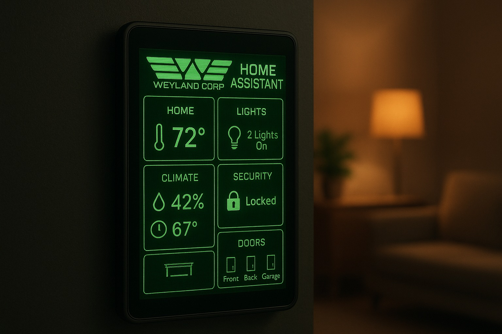
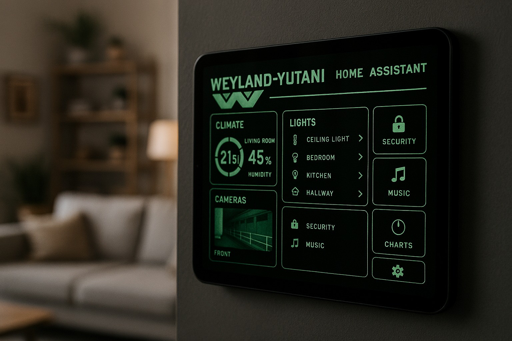
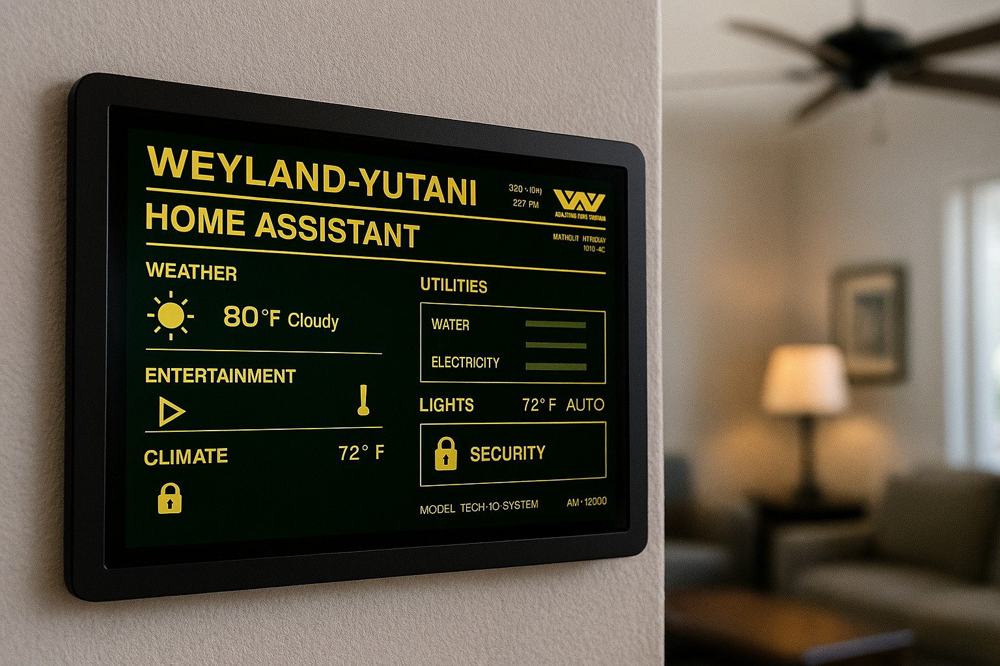

# MU/TH/UR 6000 Cards for Home Assistant

A series of custom cards for Home Assistant based on the appearance of the MU/TH/UR 6000 mainframe computer from the Alien movie franchise. These cards feature a retro green monochrome terminal aesthetic with scanline effects, terminal-style text, and the iconic Weyland-Yutani Corporation design language.

These pair nicely with the [Weyland-Yutani theme](https://github.com/loryanstrant/ha-weylandyutani).


## Inspiration

Example cards styled after the MU/TH/UR 6000 terminal (see `mother-examples/` for full-size images):

<p align="center">
  
  
  
</p>

** Note: the above images are AI generated.

## Features

- **Authentic Terminal Aesthetic**: Green monochrome display with CRT scanline effects
- **Multiple Card Types**: Status, Sensor, Button, Text, Gauge, Clock, Glance, Light, Picture, and Weather cards
- **Retro Typography**: Classic monospace terminal font styling
- **Weyland-Yutani Theme**: Compatible with the ha-weylandyutani theme
- **Customizable**: Extensive configuration options for each card type
- **Lightweight**: Built with Lit for optimal performance

## Installation

### HACS (Recommended)

1. Open HACS in your Home Assistant instance
2. Go to "Frontend" section
3. Click the menu icon in the top right
4. Select "Custom repositories"
5. Add this repository URL: `https://github.com/loryanstrant/ha-MU-TH-UR-6000-cards`
6. Select category: "Lovelace"
7. Click "Add"
8. Find "MU/TH/UR 6000 Cards" in the list and click "Install"
9. Restart Home Assistant

### Manual Installation

1. Download the `mu-th-ur-6000-cards.js` file from the latest release
2. Copy it to your `config/www` directory
3. Add the following to your `configuration.yaml`:

```yaml
lovelace:
  resources:
    - url: /local/mu-th-ur-6000-cards.js
      type: module
```

4. Restart Home Assistant

## Development

For local development and testing:

1. Clone the repository
2. Install dependencies: `npm install`
3. Build the project: `npm run build`
4. Open `test.html` in a browser to preview cards with mock data

See [CONTRIBUTING.md](CONTRIBUTING.md) for detailed development guidelines.

## Card Types

### 1. Status Card

Displays multiple entity states in a structured list format with status indicators.

#### Example


#### Configuration

```yaml
type: custom:muthur-status-card
title: SYSTEM STATUS
entities:
  - entity: binary_sensor.front_door
    name: MAIN ENTRANCE
  - entity: sensor.temperature_living_room
    name: AMBIENT TEMP
  - entity: sensor.humidity_living_room
    name: HUMIDITY LEVEL
  - entity: binary_sensor.motion_hallway
    name: MOTION DETECT
message: ALL SYSTEMS OPERATIONAL
show_message: true
```

#### Options

| Name | Type | Default | Description |
|------|------|---------|-------------|
| `title` | string | `SYSTEM STATUS` | Card header text |
| `entities` | list | **required** | List of entities to display |
| `message` | string | `ALL SYSTEMS OPERATIONAL` | System status message |
| `show_message` | boolean | `true` | Show/hide the status message |

### 2. Sensor Card

Displays a single sensor value with optional progress bar visualization.

#### Example


#### Configuration

```yaml
type: custom:muthur-sensor-card
entity: sensor.cpu_temperature
name: CORE TEMPERATURE
unit: "°C"
show_graph: true
max: 100
```

#### Options

| Name | Type | Default | Description |
|------|------|---------|-------------|
| `entity` | string | **required** | Entity ID to display |
| `name` | string | entity name | Custom display name |
| `unit` | string | entity unit | Custom unit of measurement |
| `show_graph` | boolean | `true` | Show/hide progress bar |
| `max` | number | `100` | Maximum value for progress bar |

### 3. Button Card

Interactive buttons for controlling entities or triggering services.

#### Example


##### Configuration

```yaml
type: custom:muthur-button-card
title: TERMINAL CONTROL
columns: 2
buttons:
  - entity: light.living_room
    name: ILLUMINATION
    icon: 💡
    action: toggle
    show_state: true
  - entity: switch.coffee_maker
    name: BEVERAGE SYS
    action: toggle
  - service: script.security_protocol
    name: SECURITY
    icon: 🔒
```

#### Options

| Name | Type | Default | Description |
|------|------|---------|-------------|
| `title` | string | `TERMINAL CONTROL` | Card header text |
| `columns` | number | `1` | Number of columns (1-3) |
| `buttons` | list | **required** | List of button configurations |

Button configuration:
- `entity`: Entity to control
- `name`: Button label
- `icon`: Optional icon/emoji
- `action`: Action to perform (toggle, turn_on, turn_off)
- `show_state`: Display entity state
- `service`: Alternative service call (instead of entity)
- `service_data`: Data for service call

### 4. Text Card

Displays text messages in terminal format.

#### Example


#### Configuration

```yaml
type: custom:muthur-text-card
title: SYSTEM NOTICE
content: |
  ATTENTION: CREW MEMBERS
  
  TRANSMISSION RECEIVED FROM CORPORATE
  ALL PERSONNEL REPORT TO BRIDGE
  
  - WEYLAND-YUTANI CORP
size: medium
align: left
show_prompt: true
typing_effect: false
```

#### Options

| Name | Type | Default | Description |
|------|------|---------|-------------|
| `title` | string | `MESSAGE` | Card header text |
| `content` | string | **required** | Text content to display |
| `size` | string | `medium` | Text size (small, medium, large) |
| `align` | string | `left` | Text alignment (left, center, right) |
| `show_prompt` | boolean | `true` | Show terminal prompt (>) |
| `typing_effect` | boolean | `false` | Animated typing effect |

### 5. Gauge Card

Displays a circular gauge visualization for numeric sensors with customizable thresholds.

#### Example

```yaml
type: custom:muthur-gauge-card
entity: sensor.cpu_usage
name: CPU LOAD
min: 0
max: 100
decimals: 1
severity:
  yellow: 70
  red: 90
```

#### Options

| Name | Type | Default | Description |
|------|------|---------|-------------|
| `entity` | string | **required** | Entity ID to display |
| `name` | string | entity name | Custom display name |
| `unit` | string | entity unit | Custom unit of measurement |
| `min` | number | `0` | Minimum gauge value |
| `max` | number | `100` | Maximum gauge value |
| `decimals` | number | `1` | Number of decimal places |
| `severity` | object | `{}` | Severity thresholds (yellow, red) |

### 6. Clock Card

Displays current time and date in terminal format with live updates.

#### Example

```yaml
type: custom:muthur-clock-card
title: SYSTEM TIME
format_24h: true
show_seconds: true
show_date: true
show_timezone: false
```

#### Options

| Name | Type | Default | Description |
|------|------|---------|-------------|
| `title` | string | `SYSTEM TIME` | Card header text |
| `format_24h` | boolean | `true` | Use 24-hour time format |
| `show_seconds` | boolean | `true` | Display seconds |
| `show_date` | boolean | `true` | Display date |
| `show_timezone` | boolean | `false` | Display timezone |

### 7. Glance Card

Compact multi-entity overview card displaying multiple entities in a grid.

#### Example

```yaml
type: custom:muthur-glance-card
title: SYSTEM OVERVIEW
entities:
  - entity: sensor.temperature
    name: TEMP
  - entity: sensor.humidity
    name: HUMIDITY
  - binary_sensor.motion
  - light.living_room
columns: 2
show_name: true
```

#### Options

| Name | Type | Default | Description |
|------|------|---------|-------------|
| `title` | string | `SYSTEM GLANCE` | Card header text |
| `entities` | list | **required** | List of entities to display |
| `columns` | number | auto | Number of columns (2-5) |
| `show_name` | boolean | `true` | Show entity names |

### 8. Light Card

Dedicated light entity control with brightness slider and on/off toggle.

#### Example

```yaml
type: custom:muthur-light-card
entity: light.living_room
name: MAIN ILLUMINATION
```

#### Options

| Name | Type | Default | Description |
|------|------|---------|-------------|
| `entity` | string | **required** | Light entity ID |
| `name` | string | entity name | Custom display name |

### 9. Picture Card

Display images or camera feeds with terminal-style filtering effects.

#### Example

```yaml
type: custom:muthur-picture-card
title: VISUAL FEED
entity: camera.front_door
# OR use a static image
image: /local/my-image.jpg
caption: SURVEILLANCE CAMERA 01
show_timestamp: true
```

#### Options

| Name | Type | Default | Description |
|------|------|---------|-------------|
| `title` | string | `VISUAL FEED` | Card header text |
| `entity` | string | optional | Camera entity ID |
| `image` | string | optional | Static image URL |
| `caption` | string | optional | Image caption |
| `show_timestamp` | boolean | `false` | Show capture timestamp |

**Note**: Either `entity` or `image` must be provided.

### 10. Weather Card

Display weather information with current conditions and forecast.

#### Example

```yaml
type: custom:muthur-weather-card
entity: weather.home
name: ATMOSPHERIC CONDITIONS
show_forecast: true
forecast_days: 5
```

#### Options

| Name | Type | Default | Description |
|------|------|---------|-------------|
| `entity` | string | **required** | Weather entity ID |
| `name` | string | entity name | Custom display name |
| `show_forecast` | boolean | `true` | Show weather forecast |
| `forecast_days` | number | `5` | Number of forecast days |

## Styling

All cards use CSS custom properties for easy theming:

```css
--muthur-primary-color: #00ff41;        /* Main green color */
--muthur-secondary-color: #008f11;      /* Darker green */
--muthur-background-color: #000000;     /* Background */
--muthur-border-color: #00ff41;         /* Border color */
--muthur-text-color: #00ff41;           /* Text color */
--muthur-glow-color: rgba(0, 255, 65, 0.5);  /* Glow effect */
--muthur-font-family: 'Courier New', 'Monaco', monospace;
--muthur-scanline-opacity: 0.1;         /* CRT scanline effect */
```

You can override these in your theme configuration.

### Thedus Font (Optional)

The project includes the **Thedus** font family for an even more authentic retro computer terminal look. The font files are included in the `fonts/` directory and can be enabled by importing the font stylesheet.

To use the Thedus font, add it to your Home Assistant theme or override the font family:

```css
--muthur-font-family: 'Thedus', 'Courier New', monospace;
```

Available font variants:
- `'Thedus'` - Condensed (default)
- `'Thedus Wide'` - Wide variant
- `'Thedus Stencil'` - Condensed stencil
- `'Thedus Stencil Wide'` - Wide stencil

The Thedus font provides an authentic retro computer terminal aesthetic that perfectly complements the MU/TH/UR 6000 design language. See `mother-examples/` for visual examples.

## Examples

### Security Dashboard

```yaml
type: vertical-stack
cards:
  - type: custom:muthur-text-card
    title: SECURITY SYSTEM
    content: WEYLAND-YUTANI SECURITY PROTOCOL ACTIVE
    size: large
    align: center
    
  - type: custom:muthur-status-card
    title: PERIMETER STATUS
    entities:
      - binary_sensor.front_door
      - binary_sensor.back_door
      - binary_sensor.garage_door
      - binary_sensor.motion_entrance
    message: PERIMETER SECURE
    
  - type: custom:muthur-button-card
    title: SECURITY CONTROLS
    columns: 3
    buttons:
      - entity: alarm_control_panel.home
        name: ARM SYSTEM
      - entity: script.panic_mode
        name: ALERT
      - entity: light.exterior_lights
        name: LIGHTS
```

### Climate Control

```yaml
type: horizontal-stack
cards:
  - type: custom:muthur-sensor-card
    entity: sensor.temperature_living_room
    name: AMBIENT TEMP
    show_graph: true
    max: 40
    
  - type: custom:muthur-sensor-card
    entity: sensor.humidity_living_room
    name: HUMIDITY
    show_graph: true
    max: 100
```

### System Monitoring

```yaml
type: vertical-stack
cards:
  - type: custom:muthur-clock-card
    title: SYSTEM TIME
    show_seconds: true
    show_date: true
    
  - type: horizontal-stack
    cards:
      - type: custom:muthur-gauge-card
        entity: sensor.cpu_usage
        name: CPU LOAD
        min: 0
        max: 100
        severity:
          yellow: 70
          red: 90
      
      - type: custom:muthur-gauge-card
        entity: sensor.memory_usage
        name: MEMORY
        min: 0
        max: 100
        severity:
          yellow: 80
          red: 95
  
  - type: custom:muthur-glance-card
    title: SYSTEM STATUS
    entities:
      - sensor.cpu_temperature
      - sensor.disk_use_percent
      - binary_sensor.internet_connection
      - switch.backup_system
    columns: 4
```

### Surveillance & Weather

```yaml
type: vertical-stack
cards:
  - type: custom:muthur-picture-card
    title: EXTERIOR SURVEILLANCE
    entity: camera.front_door
    caption: MAIN ENTRANCE - SECTOR A
    show_timestamp: true
    
  - type: custom:muthur-weather-card
    entity: weather.home
    name: ATMOSPHERIC CONDITIONS
    show_forecast: true
    forecast_days: 5
```

### Lighting Control

```yaml
type: horizontal-stack
cards:
  - type: custom:muthur-light-card
    entity: light.living_room
    name: LIVING QUARTERS
    
  - type: custom:muthur-light-card
    entity: light.bedroom
    name: SLEEP CHAMBER
    
  - type: custom:muthur-light-card
    entity: light.kitchen
    name: GALLEY
```

## Design Inspiration

These cards are inspired by:
- The MU/TH/UR 6000 mainframe computer from *Alien* (1979)
- The typography and design analysis from [Typeset in the Future](https://typesetinthefuture.com/2014/12/01/alien/)
- Classic CRT terminal aesthetics
- Weyland-Yutani Corporation design language

## Compatibility

- **Home Assistant**: 2023.1.0 or newer
- **Browser**: Any modern browser with ES6 support
- **Theme**: Works standalone or with ha-weylandyutani theme

## Contributing

Contributions are welcome! Please feel free to submit a Pull Request.

## Development Approach


## License

MIT License - see LICENSE file for details

---

**Note**: This is a fan-made theme inspired by the Alien franchise. Not affiliated with or endorsed by 20th Century Studios or Disney.

**"Building Better Worlds"** - Weyland-Yutani Corporation
